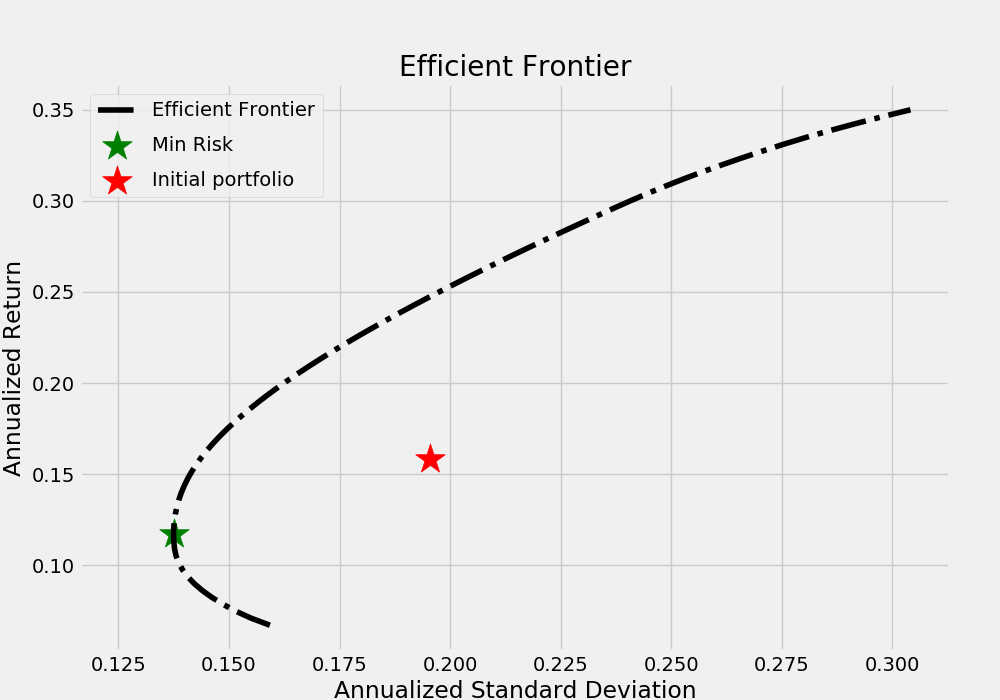
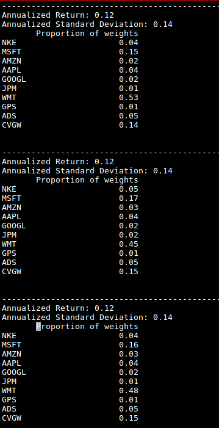

# Efficient-frontier

This python program can be used to genearate Efficient Frontier for stocks specified in code

It also outputs three different portfolio weight proportions with same risk and annual return 

